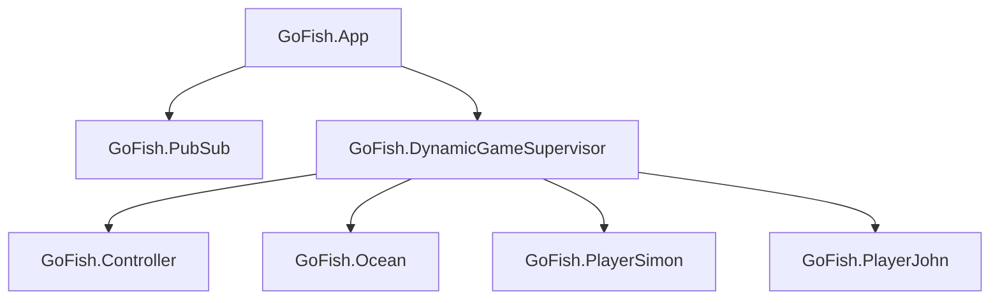

# GoFish - Elixir Implementation

A card game with multiple players.

Rules:
- Five cards are dealt from a standard 52-card deck to each player, or seven cards if there are only two players. The remaining cards are shared between the players, usually spread out in a disorderly pile referred to as the "ocean."
- The player whose turn it is to play asks another player for their cards of a particular face value. For example, Alice may ask, "Bob, do you have any threes?" Alice must have at least one card of the rank she requested. Bob must hand over all cards of that rank if possible and is responsible for delivering the cards to the player no matter their location. If he has none, Bob tells Alice to "go fish," and Alice draws a card from the pool and places it in her own hand. Then it is Bob's turn, since the turn switches to the person saying "go fish." When any player at any time has four cards of one face value, it forms a book, and the cards must be placed face up in front of that player. When all sets of cards have been laid down in books, the game ends. The player with the most books wins.
variation:
- Instead of going round in a circle the turn switches to the person saying go fish.

## Get Started

To start your Phoenix server:

  * Install dependencies with `mix deps.get`
  * Start Phoenix endpoint with `mix phx.server` or inside IEx with `iex -S mix phx.server`

Now you can visit [`localhost:4000`](http://localhost:4000) from your browser.

Ready to run in production? Please [check our deployment guides](https://hexdocs.pm/phoenix/deployment.html).

## Feature Backlog

- [x] Game logic
- [x] Website UI
- [ ] Support for playing across multiple clients
- [ ] Support for more than 2 players [#6](https://github.com/simonelnahas/go_fish/issues/6)
- [ ] LiveView update of Game State [#8](https://github.com/simonelnahas/go_fish/issues/8)

## References
- Initially inspired by this tutorial https://www.youtube.com/watch?v=OG7e5SidbCU

## Backlog
- [x] Make a separate application for the Game.
- [x] Use dynamicSupervisors to start the game
- [ ] Winner announcement screen 
- [ ] Support for multiple concurrent games [#9](https://github.com/simonelnahas/go_fish/issues/9)

## Architecture: Supervision Tree

